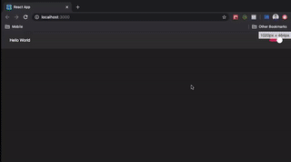

<h1 align="center">
  Projeto Theme-Switcher
</h1>

<p align="center">
  
  
  
  
  <a href="https://www.codacy.com/manual/kleytonsolinho/theme-switcher?    utm_source=github.com&amp;utm_medium=referral&amp;utm_content=engividal/tobehero&amp;utm_campaign=Badge_Grade">
  
  </a>
  
  
  
  <a href="https://github.com/engividal/tobehero/commits/master">
    
  </a>
  
  <a href="https://github.com/engividal/tobehero/issues">
    
  </a>
  
  
</p>

<p align="center">
  <a href="#%EF%B8%8F-projeto">Projeto</a>&nbsp;&nbsp;&nbsp;|&nbsp;&nbsp;&nbsp;
  <a href="#-tecnologias">Tecnologias</a>&nbsp;&nbsp;&nbsp;|&nbsp;&nbsp;&nbsp;
  <a href="#-instalação-execução-e-desenvolvimento">Instalação e Execução</a>&nbsp;&nbsp;&nbsp;|&nbsp;&nbsp;&nbsp;
  <a href="#-licença">Licença</a>
</p>

<p aling="center">
  
</p>

## 📋 Projeto

 Esta aplicação foi desenvolvida como teste para implementar um botão Switcher no tema de um site, alternando entre o modo Dark/Light.

## 🔝 Tecnologias

Esta aplicação foi desenolvida com as tecnologias abaixo:

- [ReactJS](https://reactjs.org/)


## 💻 Instalação e Execução

Faça um clone do repositório através do [GitHub Desktop](https://desktop.github.com/) ou linha de comando `git clone https://github.com/kleytonsolinho/theme-switcher.git`.

```bash
# Clone this repository
$ git clone https://github.com/kleytonsolinho/theme-switcher

# Go into the repository
$ cd theme-switcher

# Install dependencies
$ yarn install

# Run the app
$ yarn start
```

## 📝 Licença

Esse projeto está sob a licença MIT. Veja o arquivo [LICENSE](https://github.com/kleytonsolinho/theme-switcher/blob/master/LICENSE) para mais detalhes.
